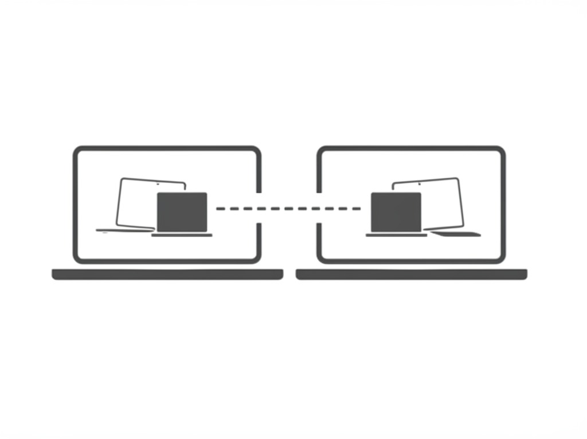

<p align="center">
    
</p>

<h1 align="center">ShadowSyncMac 🚀</h1>
<p align="center">
    <b>Real-time, seamless file sync between Macs on your network.</b>
</p>

---

## ✨ Overview

**ShadowSyncMac** is a real-time synchronization tool designed to automatically detect and sync changes (added, removed, modified files) between two Macs on the same network.  
It currently monitors specified directories for file changes, logs these events, and lays the groundwork for full syncing functionality.

---

## 🗂️ Project Structure

```
ShadowSync/
├── app.py                # 🚦 Main application entry point
├── data/
│   ├── watch_changes.py  # 👀 Monitors directories for file changes
│   ├── sync_engine.py    # 🔄 Sync engine: logic & communication
│   ├── discovery.py      # 📡 Peer discovery via UDP
│   └── ...               # 🛠️ Supporting scripts
├── logs/                 # 📝 Log files generated at runtime
└── README.md             # 📖 This documentation file
```

---

## 🌟 Features

- ⚡ **Real-time detection** of file system changes: additions, deletions, modifications  
- 📝 **Detailed logging** of file events with timestamps  
- 📡 **Network peer discovery** via UDP broadcast  
- 🔌 **Basic TCP server/client** framework for communication  
- 🧩 **Modular design** for future extensions (GUI, auto-sync, multi-network)

---

## 🚀 Getting Started

### 🛠️ Prerequisites

- Python 3.11 (recommended)
- [`watchdog`](https://pypi.org/project/watchdog/) Python package
- Network access between Macs (same LAN or direct connection)

### 📦 Installation

1. **Clone this repository:**  
     ```bash
     git clone https://github.com/yourusername/ShadowSync.git
     cd ShadowSync
     ```
2. **Install dependencies:**  
     ```bash
     pip install watchdog
     ```

### ▶️ Running

Start the main application:

```bash
python3 app.py
```

- Monitors configured directories
- Begins peer discovery on the network

### 🧪 Testing

- Run the app on two Macs connected to the same network.
- Make file changes in monitored folders to see real-time logs (added, removed, modified).
- Logs are saved under `/logs` for review.

### 🐳 Docker

> **Docker support is planned!**  
> Future updates will include a Dockerfile and images for quick setup.

### ⚡ Thunderbolt

> **Planned:** Thunderbolt direct connection ⚡ and Tailscale VPN integration 🌐.

---

## 📝 TODO

- [ ] ⚡ Thunderbolt direct connection for faster syncing (**priority**)
- [ ] 🌐 Tailscale VPN support for secure remote syncing
- [ ] 🖥️ Graphical User Interface (GUI)
- [ ] ⚔️ Conflict detection & resolution
- [ ] 🤖 Automate sync actions with user confirmation
- [ ] 🆔 Enhanced peer discovery (user/device identification)
- [ ] 🐳 Docker support for cross-platform deployment

---

## 📄 License

This project is licensed under the [MIT License](LICENSE).

---

## 🤝 Contact

Questions or contributions?  
Open an issue or submit a pull request on [GitHub](https://github.com/yourusername/ShadowSync).

<p align="center">
    
</p>

<p align="center">
    <b>Thank you for checking out ShadowSync! 💙</b>
</p>