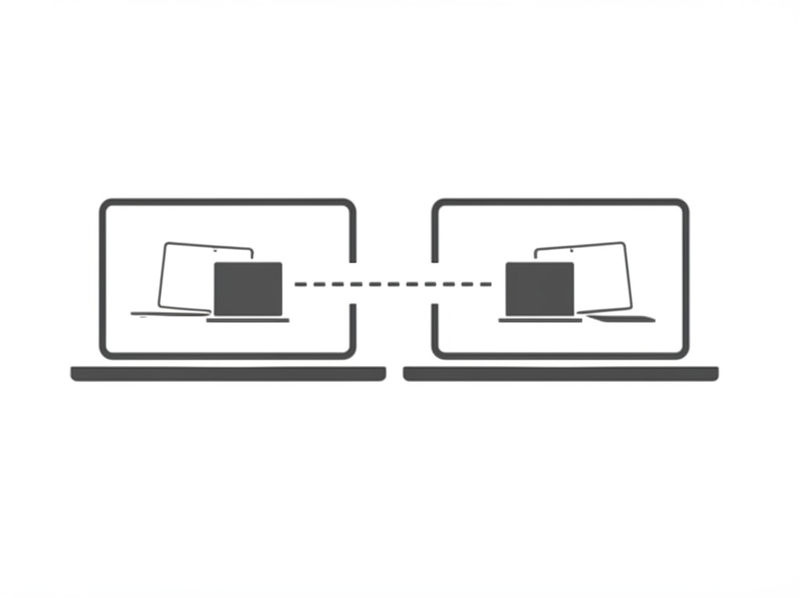

<p align="center">
    
</p>

<h1 align="center">ShadowSyncMac</h1>
<p align="center">
    <b>Production-grade, real-time P2P file sync between Macs — with automatic link selection, conflict resolution, and a native menu bar app.</b>
</p>

---

## Overview

**ShadowSyncMac** is a production-ready peer-to-peer file synchronization tool for macOS. It detects file changes in real time using FSEvents, discovers peers automatically on the local network, transfers files over the best available link (Thunderbolt, LAN, or Tailscale), and resolves conflicts with configurable strategies. A native menu bar app and a real-time web dashboard provide visibility and control without a full GUI window.

---

## Project Structure

```
ShadowSyncMac/
├── core/
│   ├── watcher.py        # FSEvents file monitoring (debounce + SHA-256 dedup)
│   ├── discovery.py      # UDP broadcast peer discovery
│   ├── sync_engine.py    # Priority queue, TCP transfer, retry logic
│   ├── transport.py      # Auto link selection: Thunderbolt > LAN > Tailscale
│   ├── conflict.py       # 5-strategy conflict resolution + audit log
│   └── ipc.py            # Unix socket IPC for dashboard/menu bar
├── config/
│   └── settings.py       # Persistent config (~/Library/Application Support/ShadowSync/)
├── ui/
│   └── dashboard.html    # Real-time web dashboard
├── app.py                # CLI entry point (full backend daemon)
├── menubar_app.py        # Native macOS menu bar app (rumps)
├── setup_app.py          # py2app bundler → dist/ShadowSync.app
├── tests/
│   ├── test_core.py
│   └── test_conflict_transport.py
└── pyproject.toml
```

---

## Features

- **Real-time file watching** via FSEvents with SHA-256 deduplication and 0.5s debounce
- **Automatic peer discovery** via UDP broadcast (port 9001, 30s peer timeout)
- **TCP file transfer** with a priority queue, 4 concurrent workers, and exponential backoff retries
- **Auto transport selection** — probes RTT and picks the fastest available link:
  - Thunderbolt Bridge (169.254.x.x) — ~40 Gbit/s
  - LAN — ~1 Gbit/s
  - Tailscale VPN (100.64.0.0/10) — ~100 Mbit/s
- **5-strategy conflict resolution**: `newer_wins`, `larger_wins`, `local_wins`, `remote_wins`, `keep_both`
- Conflict copies preserved in `~/.shadowsync_conflicts/` with a full audit log
- **Native macOS menu bar app** — live sync status icons, peer list, pause/resume, macOS notifications
- **Real-time web dashboard** — active transfers, peer connections, conflict history
- **Bandwidth throttling** (configurable kbps limit, 0 = unlimited)
- Ignores: `.DS_Store`, `.git`, `__pycache__`, `*.swp`, `*.tmp`

---

## Getting Started

### Prerequisites

- Python >= 3.11
- `watchdog` >= 4.0.0
- *(Menu bar only)* `rumps` >= 0.4.0 + `pyobjc-framework-Cocoa` >= 10.0
- Network access between Macs (same LAN, Thunderbolt Bridge, or Tailscale)

### Installation

```bash
git clone https://github.com/SiranjeviKrishnan/ShadowSyncMac.git
cd ShadowSyncMac

# Core daemon only
pip install watchdog

# + Menu bar app support
pip install rumps pyobjc-framework-Cocoa
```

### Running

**CLI daemon** (background sync engine):
```bash
python3 app.py
```

**Menu bar app** (native macOS integration):
```bash
python3 menubar_app.py
```

**Build a distributable `.app` bundle:**
```bash
pip install py2app
python3 setup_app.py py2app
# Output: dist/ShadowSync.app
```

---

## Configuration

Config file: `~/Library/Application Support/ShadowSync/config.json`

| Key | Default | Description |
|-----|---------|-------------|
| `watch_dirs` | `["~/Documents"]` | Directories to monitor and sync |
| `sync_port` | `9000` | TCP port for file transfers |
| `conflict_strategy` | `newer_wins` | `newer_wins` \| `larger_wins` \| `local_wins` \| `remote_wins` \| `keep_both` |
| `auto_sync` | `true` | Sync automatically on change |
| `sync_deletions` | `true` | Propagate deletions to peers |
| `bandwidth_limit_kbps` | `0` | Upload cap in kbps (0 = unlimited) |
| `max_file_size_mb` | `500` | Skip files larger than this |
| `log_level` | `INFO` | `DEBUG` \| `INFO` \| `WARNING` |
| `show_notifications` | `true` | macOS notifications on sync events |

---

## Testing

```bash
pytest tests/
```

To test end-to-end, run `python3 app.py` (or the menu bar app) on two Macs on the same network and make file changes in a watched directory.

---

## Logging

Logs are written to:
```
~/Library/Application Support/ShadowSync/logs/shadowsync.log
```

---

## Roadmap

- [ ] mDNS/Bonjour peer discovery (supplement UDP broadcast)
- [ ] End-to-end encryption for transfers
- [ ] Multi-directory management in the dashboard
- [ ] Windows / Linux port

---

## License

This project is licensed under the [MIT License](LICENSE).

---

## Contact

Questions or contributions? Open an issue or submit a pull request on [GitHub](https://github.com/SiranjeviKrishnan/ShadowSyncMac).

<p align="center">
    
</p>

<p align="center">
    <b>Thank you for checking out ShadowSync!</b>
</p>
